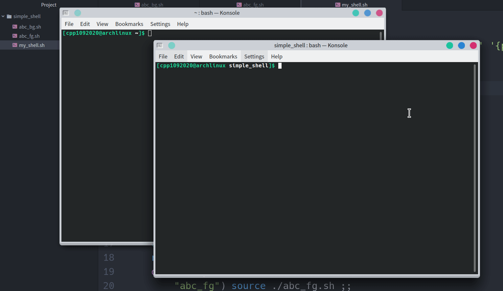

# Simple_Shell
### 測試環境
* Arch Linux KDE

### abc_fg.sh
* 命令列提示 `abc_fg >`
* 輸入
	* `^Z` 會跳出，但不停止程式
	* `hello` 印出 `Hello, ForeGround!`
	* `exit` 結束程式

### abc_bg.sh
* 沒有輸入
* 一直印出 `abc_bg > Hello, BackGround!` 並間隔 20 秒再印下一次

### my_shell.sh
* 命令列提示 `my_shell >`
* 輸入
	* `abc_fg` 執行 `abc_fg.sh`
	* `abc_bg` 執行 `makeBackgroundProcess`
	> 再背後執行 `abc_bg.sh` 並記錄該 process 的 `pid` 在 `pid.txt` 中
	* `hello` 印出 `Hello, MyShell!`
	* `exit` 刪掉背景執行的 `abc_bg.sh` 沒有的話直接退出

### Demo
