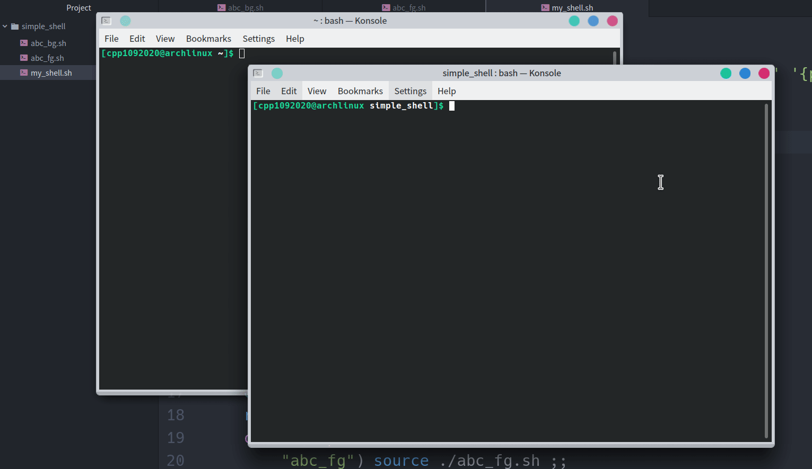

# Simple_Shell
### 測試環境
* Arch Linux KDE

### C Language

#### setup.sh
* 把 `my_shell.c` 與 `child.c` 自動化編譯成 `my_shell` 與 `child`

#### my_shell
* 命令列提示 `1092926 ms>`
* 輸入
	- `hello`，印出 `Parent process(**pid**) is int the FOREGOUND`
	- `child`， 在前景執行 `child` 執行檔（`parent process` 會 wait `child process`）
	- `child &`，在背景執行 `child` 執行檔
	- `exit`，結束程式
* 函式
	* `forkToChild(pid_t pid[], int status)`
		- 判斷 `fork()` 有沒有成功
		- `status` 為 `1` 在背景執行；`0` 則是在前景執行
	* `cleanProcess(pid_t pid[], int size)`
		- 將所有在背景執行的 `process` 都 `kill` 掉

#### child
* 前景執行
	* 命令列提示 `1092926 child>`
	* 輸入
		- `hello`，印出 `Child process(**pid**) is in the FOREGROUND.`
		- `exit`，結束程式
* 背景執行
	* 沒有輸入
	* 印出 `Child process(**pid**) is in the BACKGROUND.`
	* 間隔 `10` 秒

#### Demo

### Shell Script
#### abc_fg.sh
* 命令列提示 `abc_fg >`
* 輸入
	* `^Z` 會跳出，但不停止程式
	* `hello` 印出 `Hello, ForeGround!`
	* `exit` 結束程式

#### abc_bg.sh
* 沒有輸入
* 一直印出 `abc_bg > Hello, BackGround!` 並間隔 20 秒再印下一次

#### my_shell.sh
* 命令列提示 `my_shell >`
* 輸入
	* `abc_fg` 執行 `abc_fg.sh`
	* `abc_bg` 執行 `makeBackgroundProcess`
		> 在背後執行 `abc_bg.sh` 並記錄該 process 的 `pid` 在 `pid.txt` 中
	* `hello` 印出 `Hello, MyShell!`
	* `exit` 刪掉背景執行的 `abc_bg.sh` 沒有的話直接退出

#### Demo
